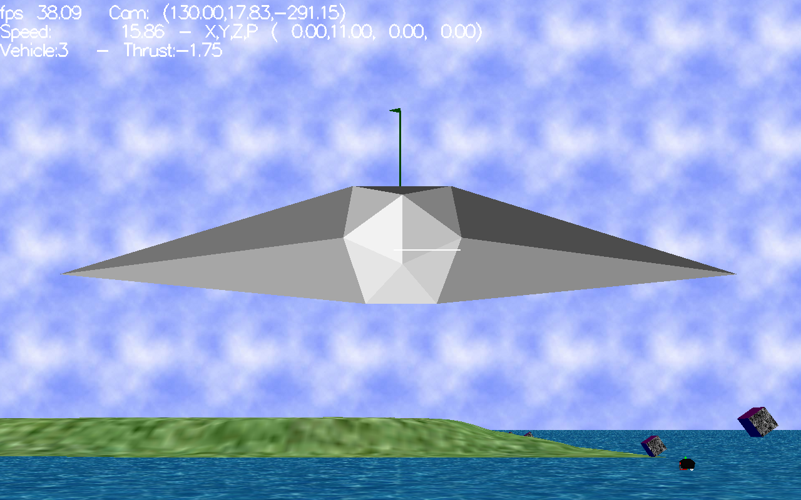

Excited warfare on the seas of a Kepler IV.

The time has come to conquer Kepler IV.



Compiling and Installation
--------------------------

'Requirements'
* ODE: Open Dynamics Engine, version 0.14: https://bitbucket.org/odedevs/ode
* Please follow the guidelines in http://ode-wiki.org/wiki/index.php?title=Manual:_Install_and_Use to install ODE on your Macbook.


 make
 ./waku

That's all folks.


ODE 0.14 Compilation on Mac Sierra
----------------------------------

* Run the following script to install automake tools for Mac

```bash
#!/bin/sh

##
# Install autoconf, automake and libtool smoothly on Mac OS X.
# Newer versions of these libraries are available and may work better on OS X
#
# This script is originally from http://jsdelfino.blogspot.com.au/2012/08/autoconf-and-automake-on-mac-os-x.html
#

export build=~/devtools # or wherever you'd like to build
mkdir -p $build

##
# Autoconf
# http://ftpmirror.gnu.org/autoconf

cd $build
curl -OL http://ftpmirror.gnu.org/autoconf/autoconf-2.69.tar.gz
tar xzf autoconf-2.69.tar.gz
cd autoconf-2.69
./configure --prefix=/usr/local
make
sudo make install
export PATH=$PATH:/usr/local/bin

##
# Automake
# http://ftpmirror.gnu.org/automake

cd $build
curl -OL http://ftpmirror.gnu.org/automake/automake-1.15.tar.gz
tar xzf automake-1.15.tar.gz
cd automake-1.15
./configure --prefix=/usr/local
make
sudo make install

##
# Libtool
# http://ftpmirror.gnu.org/libtool

cd $build
curl -OL http://ftpmirror.gnu.org/libtool/libtool-2.4.6.tar.gz
tar xzf libtool-2.4.6.tar.gz
cd libtool-2.4.6
./configure --prefix=/usr/local
make
sudo make install

echo "Installation complete."
```

* Now download the ode-0.14.tar tarball.
* Modify LIBTOOLIZE variables from 'glibtoolize' to 'libtoolize'
* ./bootstrap
* ./configure
* make clean && make && sudo make install


Issues and missing stuff
------------------------

* Floor is working greatly!  Sea is good.  Sky can be improved.
* Collision detection is working:  no friction.
* Objects modelling:  Spheres work but they are hard to control the rotational movement.  Need improvement!
* Island generation: Ok from heightmaps but has some issues with height calculation.  If the island is plain works great.
*
* Walrus mechanics works but can be improved.  The MD2 model is good but can be improved.
* Manta mechanics (based on Microsoft Flight Simulator) works barely.  It is hard to control.
* UserControl can be improved.  Sensitivity must be adjusted from within the game.
